

# Introduction

The presented qualification report performs simulations of drug disposition and pharmacokinetics in subjects with chronic kidney disease (CKD) to qualify the parameterization of the foundational anatomy and physiology parameters for virtual populations with CKD in the Open Systems Pharmacology (OSP) Suite.

CKD is defined as a reduction in kidney function as approximated by the estimated glomerular filtration rate (eGFR) below 60 mL/min/1.73m2 for at least 3 months. CKD is a systemic and multifaceted disease that alters many body systems beyond the glomerular filtration rate. As summarized by Malik et al. (2020),1 the disease can affect anatomy and physiology parameters such as kidney volume, kidney blood flow, plasma protein binding, hematocrit, gastric emptying time, small intestinal transit time, and colonic transit time. These quantitative changes have been implemented into the Open Systems Pharmacology Suite for the purpose of building mechanistic models of drug disposition, termed physiologically based pharmacokinetic (PBPK) models. The present implementation considers subjects with CKD from Stage 3 to Stage 5 (end-stage renal disease) who have not yet begun treatment with dialysis.

Beyond foundational anatomy and physiology parameters, the disease can also affect the activities or expression of metabolic enzymes (such as CYP3A4) and active drug transporters (such as the organic anion transporters, OAT1 and OAT3). Because of the varied and conflicting literature on the effects of the disease on numerous enzymes and transporters, the present parameterization is concerned only with foundational anatomy and physiology parameters that would be consistently applicable to all mechanistic simulations in CKD. When building a PBPK model for subjects with CKD, the OSP user is recommended to consult literature specific to the effect of disease on enzymes and transporters that are most relevant to the disposition of the drug in question and adapt the model parameters (e.g., activity of the enzyme) accordingly. 

This report replicates in part the evaluation of the parameterization done by Malik et al. Section 2 describes the algorithm used to generate CKD populations. Section 3 evaluates the predicted effects of CKD on pharmacokinetics for three compounds: Gabapentin, Acebutolol, Atenolol. Gabapentin is selected as an index compound that is predominantly eliminated by glomerular filtration. Atenolol additionally undergoes active tubular secretion through the organic cation transporter (OCT) system, one system whose function is largely conserved in the disease. Acebutolol also undergoes secretion through the OCT system, but has a non-renal component (hepatic metabolism) that is suggested to be unaffected by the disease. Evaluation for each compound is split into two steps: an initial model calibration against a healthy population, followed by an extension to populations of subjects with relevant staging of CKD.

# CKP Population Development

In order to generate a virtual population of subjects with CKD, the user must specify a target range for glomerular filtration rate (GFR) (minimum to maximum). PK-Sim will first generate a healthy population using the standard algorithm - including the effects of aging as appropriate - and modify the physiological parameters of the simulated individuals to replicate a realistic CKD phenotype. The details of this process are outlined in Figure 2, with references to Figure 1, and Tables 1 and 2. For a complete description, see Malik et al.1

|.PNG)|
|:-:|
|       *Figure 1: Simulated kidney volumes (left) and simulated renal cortex perfusion rates (right) in a population of adults aged 30-70 years with varying degrees of renal impairment compared with observed data from the literature.3-8 Diamonds represent individual data, whereas error bars represent the range in a study. In order to assign realistic physiological parameters to virtual individuals, quadratic equations for kidney volume and renal cortex perfusion rates were optimized to log-transformed data.*         |

|.PNG)|
|:-:|
|       *Figure 2: Algorithm for generation of virtual individuals with CKD while accounting for the effects of aging*         |

\newpage
**Table 1. Hematocrit in Patients With Chronic Kidney Disease9, 10, 11**

| **Creatinine Clearance (mL/min/1.73 m2)**    | **Men HCT (%)**  | **Women HCT (%)** |
|---------------------------------------------------------|------------------|-------------------|
| Healthy                                                 | 45.5             | 40                |
| 60<CrCl=70                                              | 45.2             | 39.9              |
| 50<CrCl=60                                              | 44.8             | 39.6              |
| 40<CrCl=50                                              | 43.3             | 39.7              |
| 30<CrCl=40                                              | 42.6             | 38.4              |
| 20<CrCl=30                                              | 41.7             | 37.4              |
| CrCl=20                                                 | 34.3             | 33.5              |
| Hemodialysis                                            | 31               | 29                |

\newpage
**Table 2. Fraction of Healthy Values (Normal Coefficient of Variation % ) in Chronic Kidney Disease Patients by Stage**

|Parameter                     |    Stage 3 (30-60 mL/min/1.73 m2)   |    Stage 4 (15-30 mL/min/1.73 m2)  |    Stage 5 (<15 mL/min/1.73 m2)   |   Dialysis   |
| :--------------------------- | :-------------------: | :---------------------: | :--------------------------: | :-------------------------: |
|Fraction unbound in plasma    |   1.0712   |    1.1612    |       1.5512      |      1.5512     |
|Gastric emptying time         |          1.0          |  1.6 (25%)14 |   1.6 (25%)13,14  |  1.6 (30%)15-18 |
|Small intestinal transit time |          1.0          |  1.4 (25%)14 |    1.4 (25%)14    |   1.8 (30%)19   |
|Colonic transit time          |          1.0          |           1.0           |             1.0              |   1.8 (50%)20   |

# Compounds

The method to generate virtual populatoins with CKD was qualified by testing its predictive performance when used in combination with PBPK models for healthy subjects in order to predict the pharmacokinetics of drugs in patients with CKD from literature.

The method was evaluated using three compounds and first considers subjects with CKD (Stage 3 to Stage 5, end-stage renal disease) who are not on dialysis. The three compounds evaluated for the first qualification are gabapentin, acebutolol, and atenolol. This evaluation replicates in part the work published by Malik et al., 2020. The objective is to determine success of the population generation method by comparing the predicted pharmacokinetics in CKD to clinical pharmacokinetic data from literature. 

Each subsection that follows will contain an introduction to the test compound, a description of the healthy PBPK model development, and the subsequent translation to a population with CKD.

## Gabapentin

Gabapentin is structurally related to the neurotransmitter, gamma aminobutyric acid (GABA). In adults, it is indicated for the management of post-herpetic neuralgia; and in adults and children 3 years and older with epilepsy, it is used as an adjunctive therapy in treating partial onset seizures with and without secondary generalization.

Gabapentin is available as a capsule, tablet, and oral solution. It is a BCS class 3 drug that is absorbed from the intestines by a process that is mediated by the active transporter, large neutral amino acid transporter 1 (LAT1, SLC7A5). This process is known to be saturable, with the bioavailability of gabapentin to be inversely proportional to the administered dose. The absolute oral bioavailability of a three times per day (tid) dosing regimen of 900, 1200, 2400, 3600, 4800 mg per day was 60, 47, 34, 33 and 27%, respectively.21 The absolute bioavailability of the lowest dose of gabapentin tested (100 mg Q8h) was 80%.22

Gabapentin is not metabolized and completely renally cleared as unchanged drug by glomerular filtration at the maximal rate. While gabapentin is a substrate of the OCT2 influx transporter in kidney, co-administration in humans with the OCT2 inhibitor C\cimetidine only reduced oral clearance of gabapentin by 14%.21 This suggests that renal clearance is likely best described by the passive process of glomerular filtration only. Gabapentin has a volume of distribution of 58 ± 6 L (mean ± SD) with a half-life of 5-7 hours.21 Additionally, it is 97% unbound in plasma.

### Gabapentin in a Healthy Population

\newpage
**Table 1** presents the drug-specific parameters of gabapentin and the values used for the oral administration model. Parameter optimization was carried out in PK-Sim using a Monte Carlo approach for exploring the parameter space, using the datasets summarized in **Table 2**.

\newpage
**Table 1. Physicochemical properties and ADME of gabapentin for the final oral model**

| **Physicochemical properties**    |                             |
|--|--|
| Octanol:water coefficient (logP)  | -0.08 Log Units             |
| Fraction unbound in plasma (fu) | 0.9724                        |
| Molecular weight (MW)             | 171.20 g/mol25                |
| pKa                               | 3.68, 10.7026                 |
| Water solubility                  | 100.00 mg/mL27                |
| **ADME**                          |                             |
| Partition coefficient             | Rodgers and Rowland         |
| Cell permeability                 | PK-Sim Standard             |
| Total apparent clearance          | 100 mL/min28                  |
| GFR fraction                      | 1.0                         |
| **Oral absorption parameters**    |                             |
| Formulation dissolution           | Immediately dissolveda    |
| LAT1 concentration                | log-normally distributed with mean 1.0 µM and geometric SD 1.40 µM                     |
| LAT1 Km                         | 8630.97 µM                  |
| LAT1 Vmax                       | 763.59 µM/min               |
| Specific intestinal permeability  | 2.09E-7 cm/min              |

aTmax of solution 29 and tablets 30 equivalent; all oral formulations modeled as dissolved.

Gabapentin was assumed to be immediately dissolved as a solution or IR formulation.

LAT1 was added as an influx transporter and its relative expression throughout the organs of the body was defined by RT-PCR within the PK-Sim database query. Based on cell line work showing no colonic permeability, colonic LAT1 was removed.22

\newpage
**Table 2** presents the gabapentin datasets used for building the oral model. Lipophilicity was optimized to -0.08 Log Units. Cell line Km values of LAT1 were found in the range of 200-500 uM31 and this value was optimized in order to accurately recreate the nonlinear absorption of gabapentin. Vmax was also optimized to the oral datasets.

\newpage
**Table 2. Pharmacokinetic datasets for gabapentin oral model construction**

| **Study**              | **Dose and administration** | **Cohort**                    | **N** | **Age (years)**a | **Weight (kg)**a |
|------------------------|-----------------------------|-------------------------------|-------|--------------------|--------------------|
| Boyd 199932          | 400 mg PO                   | White American females        | 18    | 49.1 ± 16.5        | 65.7 ± 8.5         |
| Boyd 199932          | 400 mg PO                   | White American males          | 18    | 49.9 ± 19.8        | 79.4 ± 10.8        |
| Gidal 199830         | 400 tid mg                  | European males                | 1     | 30b              | 73b              |
| Gidal 199830         | 800 tid mg                  | European males                | 1     | 30b              | 73b              |
| Gidal 199830         | 1200 tid mg                 | European males                | 1     | 30b              | 73b              |
| Gidal 199830         | 1600 tid mg                 | European males                | 1     | 30b              | 73b              |
| Tjandrawinata 201433 | 300 mg PO                   | Asian males (65%) and females | 37    | 30 \[19 – 54\]c  | 60c              |

aMean ± SD reported, or range in square brackets if SD not reported.

bAge and weight of subject estimated from a BMI of approximately 24.

cApproximated based on the reported range of BMI, 18.03 – 24.99 kg/m2.

Figure 3.1.1 demonstrates the simulated oral model PK profiles in a healthy population compared against observed Blum 1994 study data.REF

\newpage
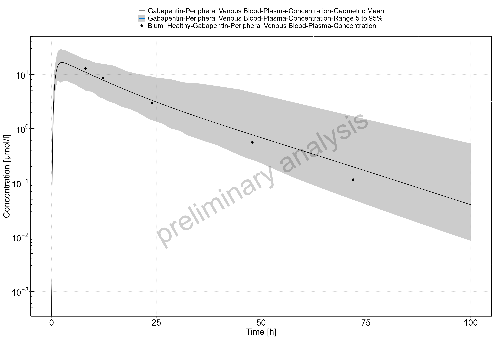

 
 

### Gabapentin in a CKD Population

With the drug-specific parameters fixed, the healthy PBPK model was translated to a CKD PBPK model CKD according to the defined method. 

A population with Stage 3 CKD was created according to the demographic parameters of the target population presented in the study of Roux 1980 (eGFR 30-59 mL/min/1.73m2). Simulation of the pharmacokinetics of gabapentin after a single oral dose of 400 mg in this target population is presented in Figure 3.1.2.

A population with Stage 4-5 CKD was created according to the demographic parameters of the target population presented in the study of Roux 1980 (eGFR 1-30 mL/min/1.73m2). Simulation of the pharmacokinetics of gabapentin after a single oral dose of 400 mg in this target population is presented in Figure 3.1.3.

\newpage
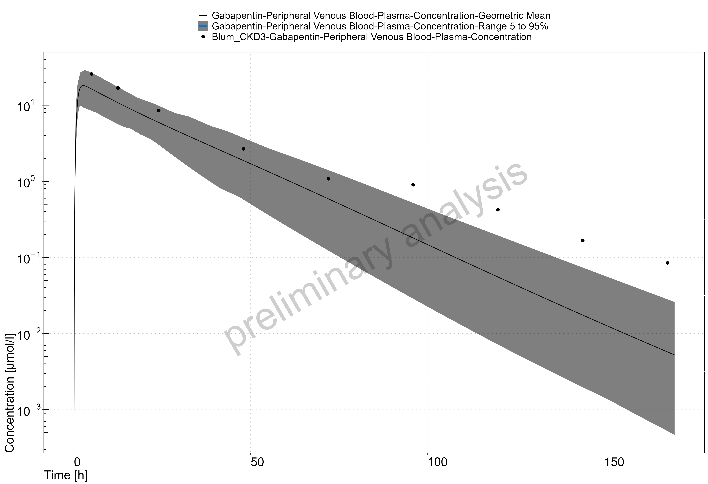

 
 

\newpage
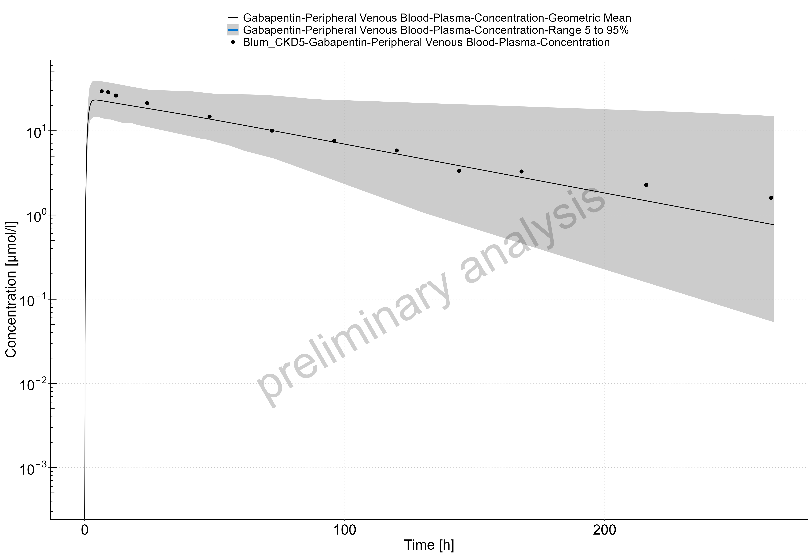

 
 

## Acebutolol

Acebutolol is a cardioselective beta-blocker with mild intrinsic sympathomimetic activity indicated for hypertension and ventricular arrhythmias. It is administered orally and classified as a BCS Class 3 drug. Acebutolol is well absorbed from the gastrointestinal tract with an absolute bioavailability of approximately 40%. Its elimination half life is 3–4 hours.35

Acebutolol undergoes extensive first pass metabolism in the liver by the two enzymes carboxylesterase 2 (CES2) and N-Acetyltransferase 2 (NAT2) to form the active metabolite diacetolol.36 Other metabolic pathways in the liver that are largely undefined also contribute. Approximately 35% of acebutolol is renally cleared35 and undergoes tubular secretion by the kidneys as demonstrated by a renal clearance of 167 mL/min.37 It has a fraction unbound of 0.85 to plasma proteins.

### Acebutolol in a Healthy Population

\newpage
**Table 1** presents the drug-specific parameters of acebutolol and the values used for the combined IV-oral model. Parameter optimization was carried out in PK-Sim using a Monte Carlo approach for exploring the parameter space, using the datasets summarized in **Table 2**.

\newpage
**Table 1. Physicochemical properties and ADME of acebutolol for the final IV-oral model**

| **Physicochemical properties**    |                             |
|--|--|
| Octanol:water coefficient (logP)           | 1.71 Log Units38 |
| Fraction unbound in plasma (fu) | 0.8540 |
| Molecular weight (MW)                      |  336.43 g/mol40 |
| pKa                                        | 9.4041 |
| Water solubility                           |  200 mg/mL41 |
| **ADME**                                   |                             |
| Partition coefficient                      | Rodgers and Rowland |
| Cell permeability                          | PK-Sim Standard     |
| Total clearance                            | 615 ± 59 mL/min42     |
| CYP concentration                          | log-normally distributed with mean 1.0 µM and geometric SD 1.40 µM   |
| CYP specific clearance                     | 0.68 1/min          |
| OCT concentration                          | normally distributed with mean 1.0 µM and SD 0.20 µM 47             |
| OCT Km                          |  100 µM |
| OCT In vitro Vmax/transporter   | 35.31 µM/min |
| GFR fraction                               |  1.0 |
| **Oral absorption parameters**             |                             |
| Dissolution half-time                      | 10 minutes |
| Dissolution profile shape                  | 0.92 |
| Intestine 1 concentration                  | 1.00 µM |
| Intestine 1 Km                  | 5000 µM |
| Intestine 1 Vmax                | 5000 µM/min |
| Intestine 2 concentration                  | normally distributed with mean 1.0 µM and SD 0.5 µM 46 |
| Intestine 2 Km                  | 5000 µM |
| Intestine 2 Vmax                | 157.34 µM/min |
| Specific intestinal permeability           | 1.48E-6 cm/min (PK-Sim calculated) |

Since acebutolol is significantly metabolized by the liver, the expression of the non-specific enzyme processes, referred to as CYP throughout this report, were added with a first order intrinsic clearance process.

Acebutolol undergoes renal transportation via MATE proteins (MATE1, MATE2/2-K) and OCT proteins (OCT2/SLC22A2). The OCT2 proteins draw acebutolol through the basolateral side of the proximal tubule cells and the MATE proteins excrete the drug into the urine from the apical side of the proximal tubule cells. The kinetics of the two transporters are difficult to identify individually as there is no in vitro data. However, it was assumed that acebutolol’s efflux is rate limited by MATE proteins and that the Permeability x Surface Area product was sufficiently fast enough to populate acebutolol in the renal epithelium. Therefore, the unknown kinetics of transport proteins were simplified into one average efflux transport protein which was represented on the apical side of the kidney. This simplified process of the OCT transport system is referred to as OCT throughout this report. The process followed active transport Michaelis-Menten kinetics and the Km of OCT was fixed at 100 µM.

The acebutolol oral formulation was developed assuming high solubility and fast dissolution based on its hydrophilicity (see **Table 1**). A Weibull function was used to describe the dissolution profile. The intestinal transporter-mediated uptake of acebutolol is likely driven by the influx of a transporter system, referred to as Intestine 2, that is located on the apical membrane of the caecum. Segment-dependent absorption was modeled by adding a fast efflux transporter to the basolateral side of the caecum, referred to as Intestine 1. Intestine 2 was added to the apical membrane of the caecum and its Km was fixed at 5000 µM to allow for linear kinetics while Vmax was optimized.

\newpage
**Table 2** presents the acebutolol datasets used for building the combined IV-oral model. The optimized CYP specific clearance, OCT Vmax, Intestine 2 Vmax, and specific intestinal permeability values are presented in **Table 1**.

The estimated fraction excreted to urine of 12% approximated the observed value of 15% measured at 70 hours after oral administration.37,43,44 In contrast, the estimated fraction excreted to urine of 21% slightly underestimated the observed value of 35% measured at 48 hours after IV bolus administration.35,42

\newpage
**Table 2. Pharmacokinetic datasets for acebutolol IV-oral model construction**

| **Study**      | **Dose and administration** | **Cohort**     | **N** | **Age (years)**a | **Weight (kg)**a |
|----------------|-----------------------------|----------------|-------|--------------------|--------------------|
| Gulaid 198143 | 400 mg PO                   | European males | 8     | 24 \[20 – 28\]     | 66.2b            |
| Roux 198037   | 200 mg PO                   | European males | 10    | 26 ± 4             | 68 ± 9             |
| Roux 198344  | 400 mg PO                   | European males | 12    | 23.5 ± 2.1         | 69.3 ± 7.5         |
| Roux 198345  | 0.35 mg/kg IV bolus         | European males | 5     | 23.4 ± 1.7         | 76 ± 3.9           |
| Roux 198345  | 400 mg PO                   | European males | 5     | 23.4 ± 1.7         | 76 ± 3.9           |

aMean ± SD reported, or range in square brackets if SD not reported.

bAverage weight not reported in study. Estimated based on an average BMI of 22 kg/m2.

Figure 3.2.1 demonstrate the simulated oral model PK profiles in a healthy population compared against observed Roux 1980 study data.37

\newpage
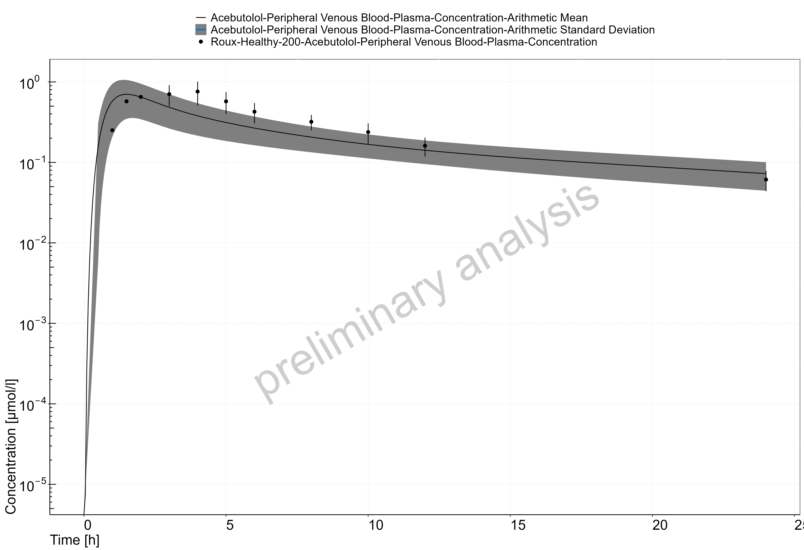

 
 

### Acebutolol in a CKD Population

With the drug-specific parameters fixed, the healthy PBPK model was translated to a CKD PBPK model CKD according to the defined method. 

A population with Stage 3-5 CKD was created according to the demographic parameters of the target population presented in the study of Roux 1980 (eGFR 6-56 mL/min/1.73m2). Simulation of the pharmacokinetics of acebutolol after a single oral dose of 200 mg in this target population is presented in Figure 3.2.2.

\newpage
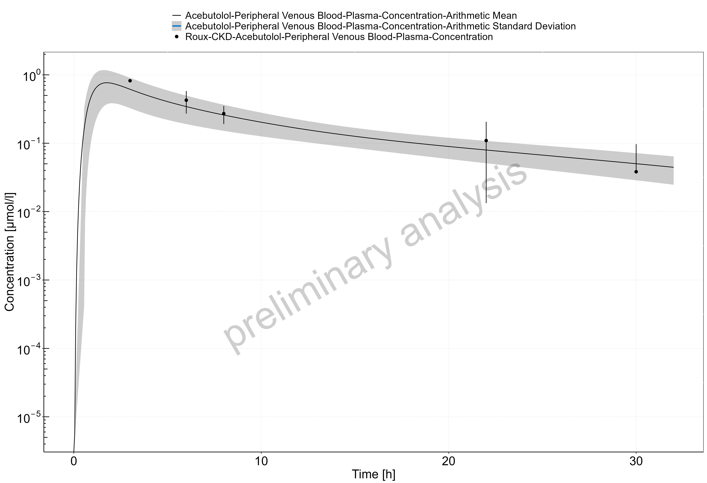

 
 

## Atenolol

Atenolol is a beta-selective beta-adrenergic receptor blocking agent. It is indicated for hypertension, angina pectoris due to coronary atherosclerosis, and acute myocardial infarction. Atenolol is 6-16% bound to proteins in plasma.48 The elimination half-life of atenolol from plasma is 6-7 hours in healthy adults.

Taken orally, atenolol is classified as a BCS Class III drug (low permeability, high solubility) with incomplete absorption in humans. It undergoes little or no metabolism by the liver, and the portion that is absorbed is mainly eliminated by renal excretion with an active tubular secretion component.49 Following oral administration, 50-60% of the dose is recovered in urine.49 These findings suggested that atenolol is not fully absorbed in the gastrointestinal tract and has a bioavailability of approximately 50%.49

Atenolol is a substrate of the organic cation transporter 2 (OCT2/SLC22A2) on the basolateral side of renal tubular epithelial cells and is a substrate for the multidrug and toxic compound extrusion proteins (MATE1, MATE2/2-K) on the apical side.50

### Atenolol in a Healthy Population

\newpage
**Table 1** and **Table 3** present the drug-specific parameters of atenolol and the values used for the IV and Oral administration models. Parameter optimization was carried out in PK-Sim using a Monte Carlo approach for exploring the parameter space, using the datasets summarized in **Table 2** and **Table 4**.

##### IV model

\newpage
**Table 1. Physicochemical properties and ADME of atenolol for the final IV model**

| **Physicochemical properties**    |                             |
|--|--|
| Octanol:water coefficient (logP)             | -0.23 Log Units |
| Fraction unbound in plasma (fu)   | 0.8948 |
| Molecular weight (MW)                        | 266.30 g/mol |
| pKa                                          | 9.6048 |
| Water solubility                             | 13.30 mg/mL48 |
| **ADME**                                     |                             |
| Partition coefficient                        | PK-Sim Standard |
| Cell permeability                            | PK-Sim Standard |
| Total clearance                              | 97.3–176.3 mL/min49 |
| OCT concentration                            | normally distributed with mean 1.0 µM and SD 0.20 µM68 |
| OCT Km                            | 200 µM51 |
| OCT Vmax                          | 18.99 µM/min |
| GFR fraction                                 | 1.0 |

Atenolol undergoes renal transportation via MATE proteins (MATE1, MATE2/2-K) and OCT proteins (OCT2/SLC22A2).50 The OCT2 proteins draw atenolol through the basolateral side of the proximal tubule cells and the MATE proteins excrete the drug into the urine from the apical side of the proximal tubule cells. The kinetics of the two transporters are difficult to identify individually. However, it was assumed that atenolol’s efflux is rate limited by MATE proteins and that the Permeability x Surface Area product was sufficiently fast enough to populate atenolol in the renal epithelium. Therefore, the unknown kinetics of transport proteins were simplified into one net efflux transport protein which was represented on the apical side of the kidney. This simplified process of the OCT transport system is referred to as OCT throughout this report. To allow the process to follow linear kinetics, the Km of OCT was fixed at a high value (200 µM).51

The PK-Sim Standard and Rodgers and Rowland methods to calculate partition coefficients were evaluated with logP and OCT Vmax for optimization to the IV datasets describing atenolol disposition. The observed PK data were best described by using the PK-Sim Standard method for partition coefficient. The PK-Sim Standard method was also used for the calculation of cell permeability.

\newpage
**Table 2** presents the atenolol datasets used for building the IV model. The optimized values are presented in **Table 1**. A proportional error model was chosen (i.e., log scaling).

\newpage
**Table 2. Pharmacokinetic datasets for atenolol IV model construction**

| **Study**     | **Dose and administration**   | **Cohort**                       | **N** | **Age (years)**a | **Weight (kg)**a   |
|---------------|-------------------------------|----------------------------------|-------|--------------------|----------------------|
| Brown 197652 | Single 10 mg IV bolus         | European males                   | 4     | 30.5 \[25 – 36\]   | 74                   |
| Brown 197652 | Single 20 mg IV bolus         | European males                   | 4     | 30.5 \[25 – 36\]   | 74                   |
| Brown 197652 | Single 50 mg IV bolus         | European males                   | 4     | 30.5 \[25 – 36\]   | 74                   |
| Brown 197652 | Single 80 mg IV bolus         | European males                   | 4     | 30.5 \[25 – 36\]   | 74                   |
| Kirch 198053 | Single 5 mg IV bolus          | European males                   | 4     | 47.5 \[26 – 69\]   | 74.1b              |
| Kirch 198154 | Single 5 mg IV bolus          | European males (71%) and females | 7     | 28.7 ± 5.9         | 67.9 ± 13.4          |
| Mason 197955 | 50 mg IV infusion over 12 min | White American males             | 12    | 24.5 \[21 – 28\]   | 71.6 \[63.6 – 79.5\] |
| Wan 197956   | Single 50 mg IV bolus         | White American males             | 6     | 24.5 \[22 – 27\]   | 72.9 \[64.5 – 79.9\] |

aMean ± SD reported, or range in square brackets if SD not reported.

bNot reported in the study. Approximated to be 74.1 kg based on cohort composition and a BMI of 24.

##### Oral model

The oral PBPK model for the atenolol tablet was developed using literature values for the dissolution profile and solubility (see **Table 3**). A Weibull function was used to describe the dissolution profile.

\newpage
**Table 3. Oral absorption parameters for the final atenolol oral model**

|   |  |
|--|--|
| Dissolution half-life            | 5 minutes                   |
| Dissolution profile shape        | 0.92                        |
| Water solubility                 | 7.90 mg/mL48      |
| Intestine 1 concentration        | 1.00 µM                     |
| Intestine 1 Km        | 5000 µM                     |
| Intestine 1 Vmax      | 5000 µM/min                 |
| PMAT concentration               | normally distributed with mean 1.0 µM and SD 0.5 µM67                   |
| PMAT Km               | 5000 µM                     |
| PMAT Vmax             | 214.7 µM/min                |
| Specific intestinal permeability | 1.15E-7 cm/min (PK-Sim calculated) |

Atenolol is predominantly absorbed in the ileum.58-61 The transporter-mediated uptake of atenolol is likely driven by the influx Plasma Membrane Monoamine Transporter (PMAT/SLC29A4) located on the apical membrane.62,63 Segment-dependent absorption was modeled by adding a fast efflux transporter to the basolateral side of the lower ileum, referred to as Intestine 1. PMAT was added to the apical membrane of the lower ileum and its Km was fixed at 5000 µM to allow for linear kinetics while Vmax was optimized. Optimization of PMAT Vmax was carried out using a Monte Carlo approach to explore the parameter space.

\newpage
**Table 4. Pharmacokinetic datasets for atenolol oral model construction**

| **Study**        | **Dose and administration** | **Cohort**                             | **N** | **Age (years)**a | **Weight (kg)**a   |
|------------------|-----------------------------|----------------------------------------|-------|--------------------|----------------------|
| Brown 197652    | 50 mg PO                    | European males                         | 4     | 30.5 \[25 – 36\]   | 74                   |
| Conway 197664  | 100 mg PO                   | European males                         | 5     | 38 \[34 – 45\]     | 69 \[64 – 73\]       |
| Frost 201765   | 100 mg PO                   | White American males (87%) and females | 14    | 29 ± 8             | 80.9 ± 10.4          |
| Kirch 198154    | 100 mg PO daily             | European males (71%) and females       | 7     | 28.7 ± 5.9         | 67.9 ± 13.4          |
| Mason 197955    | 25 mg PO solution           | White American males                   | 12    | 24.5 \[22 – 27\]   | 72.9 \[64.5 – 79.9\] |
| Mason 197955    | 100 mg PO solution          | White American males                   | 12    | 24.5 \[22 – 27\]   | 72.9 \[64.5 – 79.9\] |
| Sassard 197766 | 100 mg PO                   | European Males                         | 12    | 30b              | 69 ± 4c            |
| Wan 197956      | 50 mg PO                    | White American males                   | 12    | 28.5 \[21 – 36\]   | 68.6 \[64.5 – 87.6\] |
| Wan 197956      | 100 mg PO                   | White American males                   | 12    | 28.5 \[21 – 36\]   | 68.6 \[64.5 – 87.6\] |

aMean ± SD reported, or range in square brackets or another noted measure if SD not reported.

bAge not reported. Estimated to be 30 years old based on cohort composition.

cMean ± SE reported.

Figures 3.3.1, 3.3.2, and 3.3.3 demonstrate the simulated oral model PK profiles in a population compared against observed data from Wan 1979, Kirch 1981, and Sassard 1977, respectively.REF,REF,REF.

\newpage
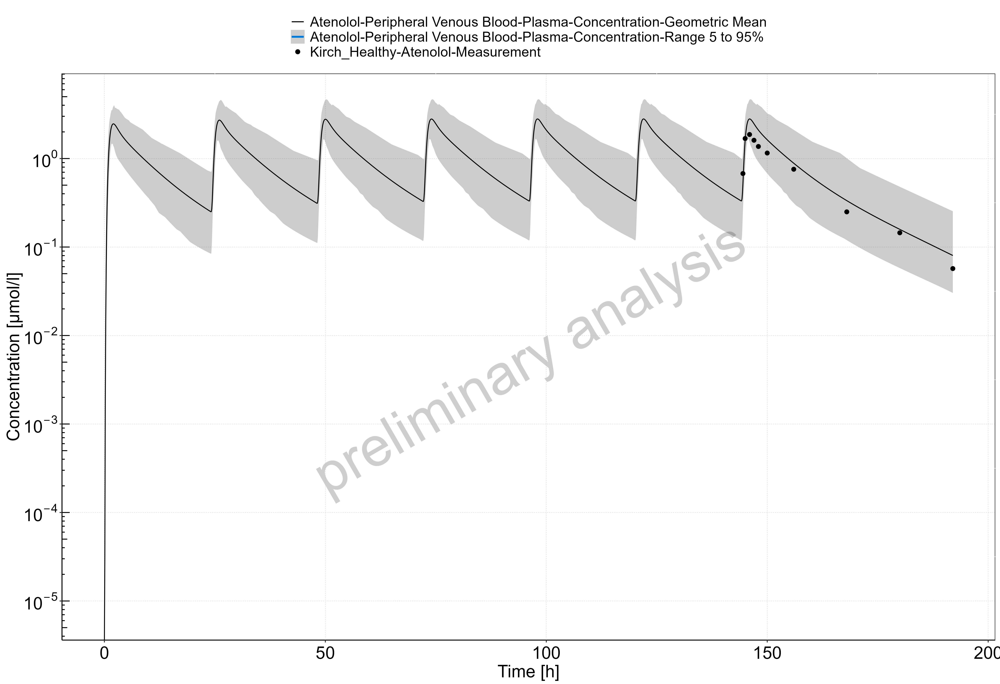

 
 

\newpage
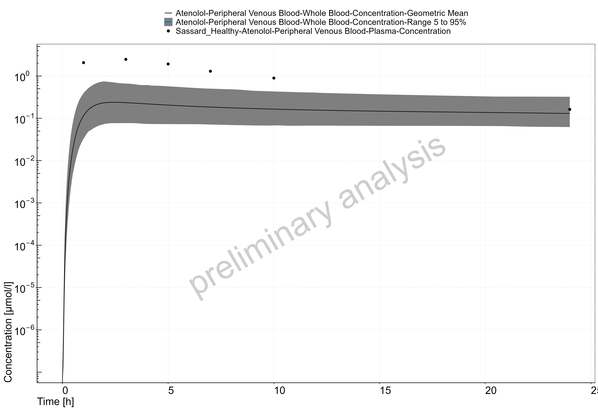

 
 

\newpage

 
 

### Atenolol in a CKD Population

With the drug-specific parameters fixed, the healthy PBPK model was translated to a CKD PBPK model CKD according to the defined method. 

A population with Stage 3 CKD was created according to the demographic parameters of the target population presented in the study of Kirch 1981 (eGFR 37-60 mL/min/1.73m2). Simulation of the pharmacokinetics of atenolol after multiple oral doses of 100 mg once daily for 7 days in this target population is presented in Figure 3.3.4.

A population with Stage 4 CKD was created according to the demographic parameters of the target population presented in the study of Kirch 1981 (eGFR 17-30 mL/min/1.73m2). Simulation of the pharmacokinetics of atenolol after multiple oral doses of 100 mg once daily for 7 days in this target population is presented in Figure 3.3.5.

A population with Stage 5 CKD was created according to the demographic parameters of the target population presented in the study of Kirch 1981 (eGFR 5-9 mL/min/1.73m2). Simulation of the pharmacokinetics of atenolol after multiple oral doses of 100 mg once daily for 7 days in this target population is presented in Figure 3.3.6.

A population with Stage 3 CKD was created according to the demographic parameters of the target population presented in the study of Sassard 1977 (eGFR 46-60 mL/min/1.73m2). Simulation of the whole blood pharmacokinetics of atenolol after a single oral dose of 100 mg in this target population is presented in Figure 3.3.7.

A population with Stage 4-5 CKD was created according to the demographic parameters of the target population presented in the study of Sassard 1977 (eGFR 8-24 mL/min/1.73m2). Simulation of the whole blood pharmacokinetics of atenolol after a single oral dose of 100 mg in this target population is presented in Figure 3.3.8.

A population with Stage 3-4 CKD was created according to the demographic parameters of the target population presented in the study of Wan 1979 (eGFR 15-42 mL/min/1.73m2). Simulation of the pharmacokinetics of atenolol after a single oral dose of 50 mg in this target population is presented in Figure 3.3.9.

\newpage
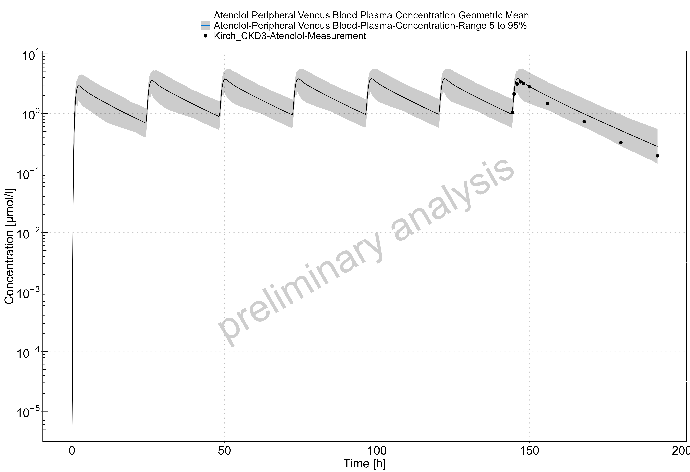

 
 

\newpage
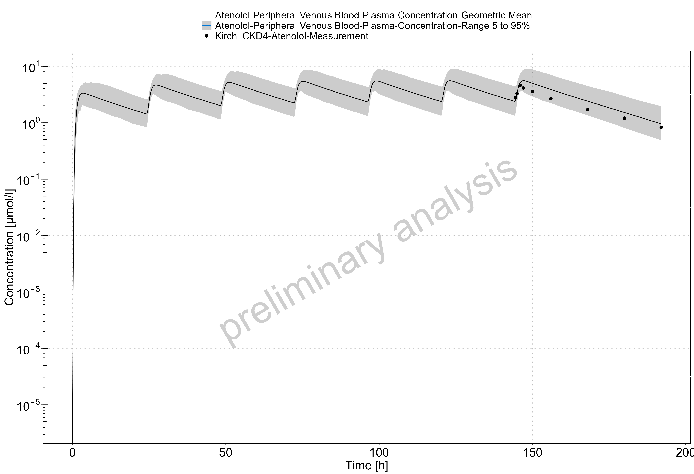

 
 

\newpage
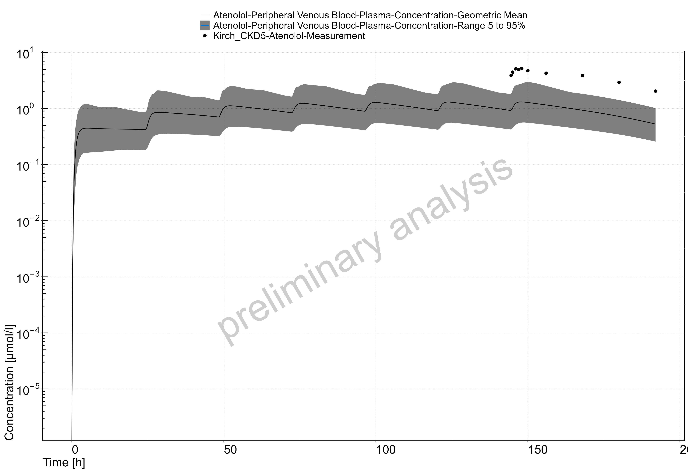

 
 

\newpage

 
 

\newpage
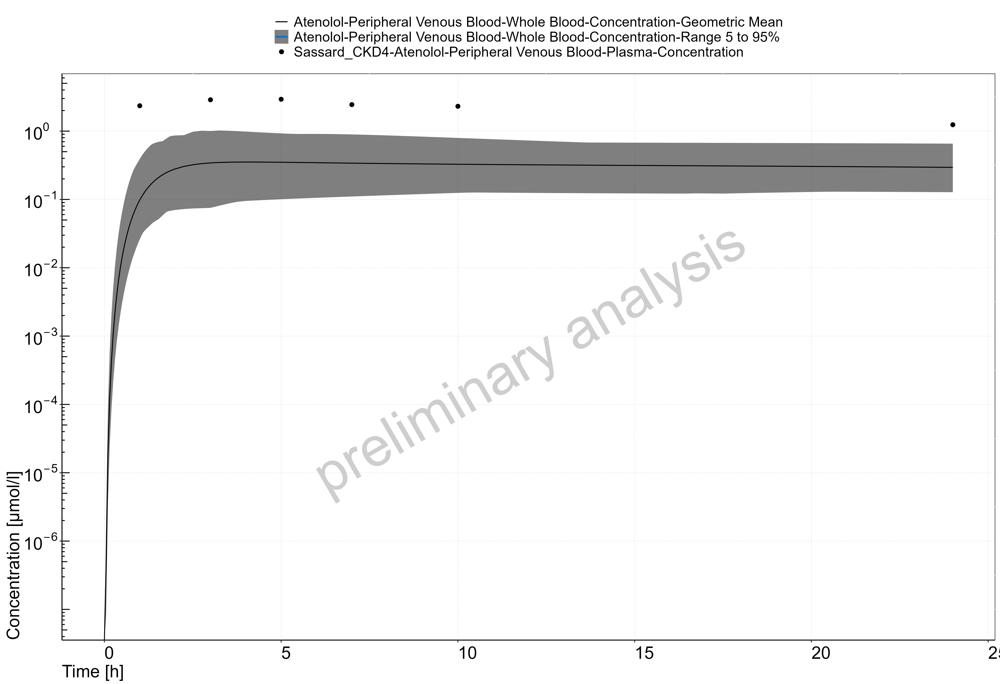

 
 

\newpage
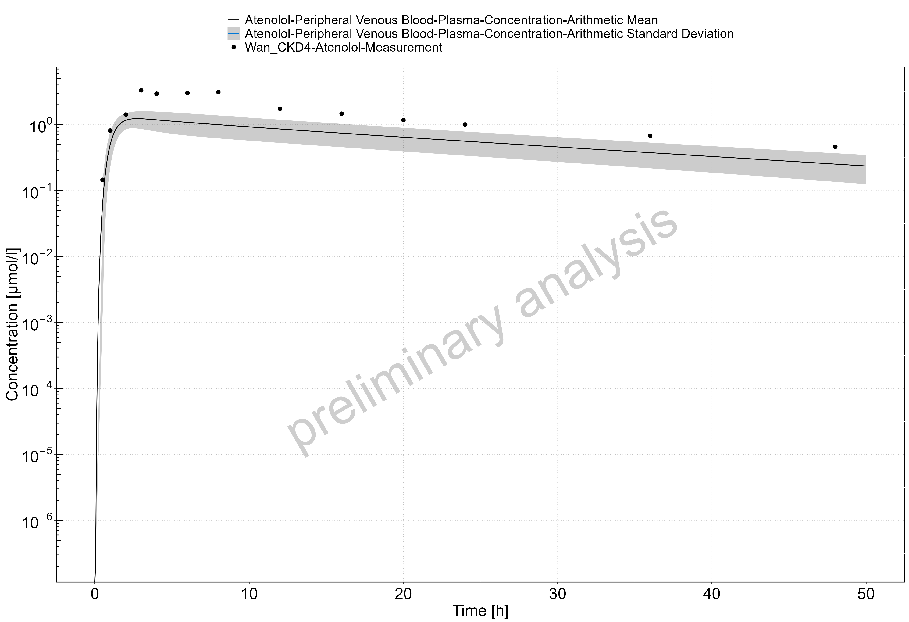

 
 

# References

1.    Malik PR, Yeung CH, Ismaeil S, Advani U, Djie S, Edginton AN. A physiological approach to pharmacokinetics in chronic kidney disease. The Journal of Clinical Pharmacology. 2020 Nov;60:S52-62.
2. Willmann S, Hohn K, Edginton A, et al. Development of a physiology-based whole-body population model for assessing the influence of individual variability on the pharmacokinetics of drugs. J Pharmacokinet Pharmacodyn. 2007;34(3):401-31.
3. Vegar Zubovic S, Kristic S, Sefic Pasic I. Relationship be-tween ultrasonographically determined kidney volume and progression of chronic kidney disease. Med Glas (Zenica). 2016;13(2):90-94
4. Jovanovic D, Gasic B, Pavlovic S, Naumovic R. Correlation of kidney size with kidney function and anthropometric parameters in healthy subjects and patients with chronic kidney diseases. Ren Fail. 2013;35(6):896-900.
5. Kim HC, Yang DM, Jin W, Lee SH. Relation between total renal volume and renal function: usefulness of 3D sonographic measurements with a matrix array transducer. AJR Am J Roentgenol. 2010;194(2):W186-192.
6. Buchanan CE, Mahmoud H, Cox EF, et al. Quantitative assessment of renal structural and functional changes in chronic kidney disease using multi-parametric magnetic resonance imaging. Nephrol Dial Transplant. 2020;35(6):955-964.
7. Gillis KA, McComb C, Patel RK, et al. Non-contrast renal magnetic resonance imaging to assess perfusion and corticomedullary differentiation in health and chronic kidney disease. Nephron. 2016;133(3):183-192.
8. Rossi C, Artunc F, Martirosian P, Schlemmer HP, Schick F, Boss A. Histogram analysis of renal arterial spin labeling per-fusion data reveals differences between volunteers and patients with mild chronic kidney disease. Invest Radiol. 2012;47(8):490-496.
9.  Hsu C-Y, Bates DW, Kuperman GJ, Curhan GC. Relationship between hematocrit and renal function in men and women. Kidney Int. 2001;59(2):725-731.
10. Xia H, Ebben J, Ma JZ, Collins AJ. Hematocrit levels and hospitalization risks in hemodialysis patients. J Am Soc Nephrol. 1999;10(6):1309-1316.
11. Ma JZ, Ebben J, Xia H, Collins AJ. Hematocrit level and associated mortality in hemodialysis patients. J Am Soc Nephrol. 1999;10(3):610-619.
12. Tan ML, Yoshida K, Zhao P, et al. Effect of chronic kidney dis-ease on nonrenal elimination pathways: a systematic assessment of CYP1A2, CYP2C8, CYP2C9, CYP2C19, and OATP. Clin Pharmacol Ther. 2018;103(5):854-867.
13. Hirako M, Kamiya T, Misu N, et al. Impaired gastric motility and its relationship to gastrointestinal symptoms in patients with chronic renal failure. J Gastroenterol. 2005;40(12):1116.
14. Fu R-G, Wang Y, Yuan H-Z, et al. Effects of chronic renal failure on gastrointestinal motility: a study on the changes of gastric emptying, small intestinal transit, interdigestive myoelectric complex, and fecal water content. Ren Fail. 2011;33(6):615-621.
15. Guz G, Bali M, Poyraz NY, et al. Gastric emptying in patients on renal replacement therapy. Ren Fail. 2004;26(6):619-624.
16. De Schoenmakere G, Vanholder R, Rottey S, Duym P, Lameire N. Relationship between gastric emptying and clinical and biochemical factors in chronic haemodialysis patients. Nephrol Dial Transplant. 2001;16(9):1850-1855.
17. Van Vlem B, Schoonjans R, Vanholder R, et al. Delayed gastric emptying in dyspeptic chronic hemodialysis patients. Am J Kidney Dis. 2000;36(5):962-968.
18. Broberg B, Madsen JL, Fuglsang S, et al. Gastrointestinal motility in patients with end-stage renal disease on chronic hemodialysis. Neurogastroenterol Motil. 2019;31(4):e13554.
19. Hoibian E, Florens N, Koppe L, Vidal H, Soulage CO. Distal colon motor dysfunction in mice with chronic kidney disease: Putative role of uremic toxins. Toxins (Basel). 2018;10(5):204.
20. Wu MJ, Chang CS, Cheng CH, et al. Colonic transit time in long-term dialysis patients. Am J Kidne Dis. 2004;44(2):322-327.
21.  Pfizer. Neurontin (Gabapentin) Label. 2017.
22.  Bockbrader HN, Wesche D, Miller R, Chapel S, Janiczek N, Burger P. A comparison of the pharmacokinetics and pharmacodynamics of pregabalin and gabapentin. Clin Pharmacokinet. 2010;49(10):661-9.
23.  Vollmer KO, von Hodenberg A, Kolle EU. Pharmacokinetics and metabolism of gabapentin in rat, dog and man. Arzneimittelforschung. 1986;36(5):830-9.
24.  Urban TJ, Brown C, Castro RA, et al. Effects of genetic variation in the novel organic cation transporter, OCTN1, on the renal clearance of gabapentin. Clin Pharmacol Ther. 2008;83(3):416-21.
25.  PubChem. Gabapentin. https://pubchem.ncbi.nlm.nih.gov/compound/Gabapentin. 
26.  Madan J, Chawla G, Arora V, Malik R, Bansal AK. Unbiased membrane permeability parameters for gabapentin using boundary layer approach. AAPS J. 2005;7(1):E224-30.
27.  Kasim NA, Whitehouse M, Ramachandran C, et al. Molecular properties of WHO essential drugs and provisional biopharmaceutical classification. Mol Pharm. 2004;1(1):85-96.
28.  Raouf M, Atkinson TJ, Crumb MW, Fudin J. Rational dosing of gabapentin and pregabalin in chronic kidney disease. J Pain Res. 2017;10:275-8.
29.  Gidal BE, Radulovic LL, Kruger S, Rutecki P, Pitterle M, Bockbrader HN. Inter- and intra-subject variability in gabapentin absorption and absolute bioavailability. Epilepsy Res. 2000;40(2-3):123-7.
30. Gidal BE, DeCerce J, Bockbrader HN, et al. Gabapentin bioavailability: effect of dose and frequency of administration in adult patients with epilepsy. Epilepsy Res. 1998;31(2):91-9.
31. Dickens D, Webb SD, Antonyuk S, et al. Transport of gabapentin by LAT1 (SLC7A5). Biochem Pharmacol. 2013;85(11):1672-83.
32. Boyd RA, Turck D, Abel RB, Sedman AJ, Bockbrader HN. Effects of age and gender on single-dose pharmacokinetics of gabapentin. Epilepsia. 1999;40(4):474-9.
33. Tjandrawinata RR, Setiawati E, Putri RS, Yunaidi DA, Amalia F, Susanto LW. Single dose pharmacokinetic equivalence study of two gabapentin preparations in healthy subjects. Drug Des Devel Ther. 2014;8:1249-55.
34.   Blum RA, Comstock TJ, Sica DA, et al. Pharmacokinetics of gabapentin in subjects with various degrees of renal function. Clin Pharmacol Ther. 1994;56(2):154-159.
35.  Reddy Pharmaceuticals. Sectral (Acebutolol Hydrochloride) Label. 2007.
36.  Muta K, Fukami T, Nakajima M. A proposed mechanism for the adverse effects of acebutolol: CES2 and CYP2C19-mediated metabolism and antinuclear antibody production. Biochem Pharmacol. 2015;98(4):659-70.
37.  Roux A, Aubert P, Guedon J, Flouvat B. Pharmacokinetics of acebutolol in patients with all grades of renal failure. Eur J Clin Pharmacol. 1980;17(5):339-48.
38.  DrugBank. Acebutolol. https://www.drugbank.ca/drugs/DB01193. 
39.  Taylor DC, Pownall R, Burke W. The absorption of beta-adrenoceptor antagonists in rat in-situ small intestine; the effect of lipophilicity. J Pharm Pharmacol. 1985;37(4):280-3.
40.  Coombs TJ, Coulson CJ, Smith VJ. Blood plasma binding of acebutolol and diacetolol in man. B J Clin Pharmacol. 1980;9(4):395-7.
41.  Foster RJ, Carr RA. Acebutolol. In: Florey K, ed. Analytical Profiles of Drug Substances. Vol 19. Academic Press; 1990:1-26.
42.  Roux A, Flouvat B, Fouache Y, Bourdarias JP. Systemic bioavailability of acebutolol in man. Biopharm Drug Dispos. 1983;4(3):293-7.
43.  Gulaid AA, James IM, Kaye CM, et al. The pharmacokinetics of acebutolol in man, following the oral administration of acebutolol HCl as a single dose (400 mg), and during and after repeated oral dosing (400 mg, b.d.). Biopharm Drug Dispos. 1981;2(2):103-14.
44. Roux A, Le Liboux A, Delhotal B, Gaillot J, Flouvat B. Pharmacokinetics in man of acebutolol and hydrochlorothiazide as single agents and in combination. Eur J Clin Pharmacol. 1983;24(6):801-6.
45. Roux A, Henry JF, Fouache Y, et al. A pharmacokinetic study of acebutolol in aged subjects as compared to young subjects. Gerontology. 1983;29(3):202-8.
46. Meier Y, Eloranta JJ, Darimont J, et al. Regional distribution of solute carrier mRNA expression along the human intestinal tract. Drug Metab Dispos. 2007;35(4):590-4.
47. Basit A, Radi Z, Vaidya VS, Karasu M, Prasad B. Kidney cortical transporter expression across species using quantitative proteomics. Drug Metab Dispos. 2019;47(8):802-8.
48.  DrugBank. Atenolol. https://www.drugbank.ca/drugs/DB00335.
49.  Kirch W, Görg K. Clinical pharmacokinetics of atenolol—a review. Eur J Drug Metab Pharmacokinet. 1982;7(2):81-91.
50.  Ivanyuk A, Livio F, Biollaz J, Buclin T. Renal drug transporters and drug interactions. Clin Pharmacokinet. 2017;56(8):825-92.
51.  Yin J, Duan H, Shirasaka Y, Prasad B, Wang J. Atenolol renal secretion is mediated by human organic cation transporter 2 and multidrug and toxin extrusion proteins. Drug Metab Dispos. 2015;43(12):1872-81.
52.  Colin Brown H, George Carruthers S, Dennis Johnston G, et al. Clinical pharmacologic observations on atenolol, a beta-adrenoceptor blocker. Clin Pharmacol Ther. 1976;20(5):524-34.
53.  Kirch W, Schafer M, Braun M. Single intravenous dose kinetics accumulation of atenolol in patients with impaired renal function and on hemodialysis. Arch Toxicol Suppl. 1980;4:366-9.
54.  Kirch W, Köhler H, Mutschler E, Schäfer M. Pharmacokinetics of atenolol in relation to renal function. Eur J Clin Pharmacol. 1981;19(1):65-71.
55.  Mason WD, Winer N, Kochak G, Cohen I, Bell R. Kinetics and absolute bioavailability of atenolol. Clin Pharmacol Ther. 1979;25(4):408-15.
56.  Wan S, Koda R, Maronde R. Pharmacokinetics, pharmacology of atenolol and effect of renal disease. Br J Clin Pharmacol. 1979;7(6):569-74.
57. Moneghini M, Carcano A, Zingone G, Perissutti B. Studies in dissolution enhancement of atenolol. Part I. Int J Pharmaceutics. 1998;175(2):177-83.
58. Taylor DC, Grundy R, Loveday B. Chronic dog intestinal loop model for studying drug absorption as exemplified by ß-adrenoreceptor blocking agents, atenolol and propranolol. J Pharm Sci. 1981;70(5):516-21.
59. Taylor DC, Pownall R, Burke W. The absorption of beta-adrenoceptor antagonists in rat in-situ small intestine; the effect of lipophilicity. J Pharm Pharmacol. 1985;37(4):280-3.
60. Dobson CL, Davis SS, Chauhan S, Sparrow RA, Wilding IR. The effect of ileal brake activators on the oral bioavailability of atenolol in man. Int J Pharmaceutics. 2002;248(1-2):61-70.
61. Schipper NG, Vårum KM, Stenberg P, Ocklind G, Lennernäs H, Artursson P. Chitosans as absorption enhancers of poorly absorbable drugs. 3: Influence of mucus on absorption enhancement. Eur J Pharm Sci. 1999;8(4):335-43.
62. Murakami T. Absorption sites of orally administered drugs in the small intestine. Expert Opin Drug Discov. 2017;12(12):1219-32.
63. Mimura Y, Yasujima T, Ohta K, Inoue K, Yuasa H. Functional identification of Plasma Membrane Monoamine Transporter (PMAT/SLC29A4) as an atenolol transporter sensitive to flavonoids contained in apple juice. J Pharm Sci. 2017;106(9):2592-98.
64. Conway F, Fitzgerald J, McAinsh J, Rowlands D, Simpson W. Human pharmacokinetic and pharmacodynamic studies on the atenolol (ICI 66,082), a new cardioselective beta-adrenoceptor blocking drug. Br J Clin Pharmacol. 1976;3(2):267-72.
65. Frost C, Song Y, Yu Z, et al. The effect of apixaban on the pharmacokinetics of digoxin and atenolol in healthy subjects. Clin Pharmacol. 2017;9:19-28.
66. Sassard J, Pozet N, McAinsh J, Legheand J, Zech P. Pharmacokinetics of atenolol in patients with renal impairment. Eur J Clin Pharmacol. 1977;12(3):175-80.
67. Meier Y, Eloranta JJ, Darimont J, et al. Regional distribution of solute carrier mRNA expression along the human intestinal tract. Drug Metab Dispos. 2007;35(4):590-4.
68. Basit A, Radi Z, Vaidya VS, Karasu M, Prasad B. Kidney cortical transporter expression across species using quantitative proteomics. Drug Metab Dispos. 2019;47(8):802-8.
69.  Sandoz Canada Inc. Gentamicin Injection USP. 2017. https://www.sandoz.ca/sites/www.sandoz.ca/files/Gentamicin%20Inj%20Product%20Monograph.pdf.
70.  APP Fresenius Kabi USA. Gentamicin Injection USP. 2013. https://www.accessdata.fda.gov/drugsatfda_docs/label/2014/062366s033lbl.pdf.
71.  Regamey C, Gordon RC, Kirby WMM. Comparative pharmacokinetics of tobramycin and gentamicin. Clin Pharmacol Ther. 1973;14(3):396-403.
72.  DrugBank. Gentamicin. https://www.drugbank.ca/drugs/DB00798.
73.  PubChem. Gentamicin. https://pubchem.ncbi.nlm.nih.gov/compound/Gentamicin.
74.  Dagil R, O'Shea C, Nykjaer A, Bonvin AM, Kragelund BB. Gentamicin binds to the megalin receptor as a competitive inhibitor using the common ligand binding motif of complement type repeats: insight from the nmr structure of the 10th complement type repeat domain alone and in complex with gentamicin. J Biol Chem. 2013;288(6):4424-35.
75.  Gyselynck AM, Forrey A, Cutler R. Pharmacokinetics of gentamicin: distribution and plasma and renal clearance. J Infect Dis. 1971;124 Suppl:S70-6.
76.  Davey PG, Geddes AM, Gonda I, Harpur ES, Scott DK. Comparison of methods for estimating gentamicin clearance and retrospective analysis of changes in clearance with emphasis on patients with normal renal function. Br J Clin Pharmacol. 1984;17(2):147-55.
77.  Dume T, Wetzels E, Herms W, Schröder E, Wahlig H. Zur Pharmakokinetik von Gentamycinsulfat bei Gesunden und Patienten mit terminaler Niereninsuffizienz. Dtsch med Wochenschr. 1971;96(17):734-41.
78. Lorentzen H, Kallehave F, Kolmos HJ, Knigge U, Bulow J, Gottrup F. Gentamicin concentrations in human subcutaneous tissue. Antimicrob Agents Chemother. 1996;40(8):1785-9.
79. Meunier F, Van der Auwera P, Schmitt H, de Maertelaer V, Klastersky J. Pharmacokinetics of gentamicin after i.v. infusion or iv bolus. J Antimicrob Chemother. 1987;19(2):225-31.
80.   Ervin FR, Bullock WE, Jr., Nuttall CE. Inactivation of gentamicin by penicillins in patients with renal failure. Antimicrob Agents Chemother. 1976;9(6):1004-1011.
81.  DrugBank. Pindolol. https://www.drugbank.ca/drugs/DB00960.
82.  Hsyu P-H, Giacomini KM. Stereoselective renal clearance of pindolol in humans. J Clin Invest. 1985;76(5):1720-6.
83.  Cheung SYA, Rodgers T, Aarons L, et al. Whole body physiologically based modelling of ß-blockers in the rat: events in tissues and plasma following an i.v. bolus dose. Br J Pharmacol. 2018;175(1):67-83.
84.  Ivanyuk A, Livio F, Biollaz J, Buclin T. Renal drug transporters and drug interactions. Clin Pharmacokinet. 2017;56(8):825-92.
85.  Galeazzi RL, Gugger M, Weidmann P. Beta blockade with pindolol: differential cardiac and renal effects despite similar plasma kinetics in normal and uremic man. Kidney Int. 1979;15(6):661-8.
86.  Guerret M, Cheymol G, Aubry J, Cheymol A, Lavene D, Kiechel J. Estimation of the absolute oral bioavailability of pindolol by two analytical methods. Eur J Clin Pharmacol. 1983;25(3):357-9.
87.  Lavene D, Weiss Y, Safar M, et al. Pharmacokinetics and hepatic extraction ratio of pindolol in hypertensive patients with normal and impaired renal function. J Clin Pharmacol. 1977;17(8-9):501-8.
88.  Sakurada W, Shimoyama T, Itoh K, Kobayashi M. Solubility estimation for drugs treated with the simple suspension method using available dissolution test profiles. Iryo Yakugaku. 2015;41(8):540-9.
89.  Aellig W, Nüesch E, Pacha W. Pharmacokinetic comparison of pindolol 30 mg retard and 15 mg normal tablets. Eur J Clin Pharmacol. 1982;21(6):451-5.
90. Balant L, Muir K, Dayer P, et al. Simultaneous tubular excretion and reabsorption of pindolol in man. Eur J Clin Pharmacol. 1981;21(1):65-72.
91. Gretzer I, Alvan G, Duner H, Garle M, Sjöqvist F. Beta-blocking effect and pharmacokinetics of pindolol in young and elderly hypertensive patients. Eur J Clin Pharmacol. 1986;31(4):415-8.
92. Basit A, Radi Z, Vaidya VS, Karasu M, Prasad B. Kidney cortical transporter expression across species using quantitative proteomics. Drug Metab Dispos. 2019;47(8):802-8.
93.  Hanyok JJ. Clinical pharmacokinetics of sotalol. Am J Cardiol. 1993;72(4):19a-26a.
94.  Ivanyuk A, Livio F, Biollaz J, Buclin T. Renal drug transporters and drug interactions. Clin Pharmacokinet. 2017;56(8):825-92.
95.  Yang Y, Faustino PJ, Volpe DA, Ellison CD, Lyon RC, Yu LX. Biopharmaceutics classification of selected ß-blockers: solubility and permeability class membership. Mol Pharm. 2007;4(4):608-14.
96.  Belpaire FM, Bogaert MG, Rosseneu M. Binding of ß-adrenoceptor blocking drugs to human serum albumin, to a1-acid glycoprotein and to human serum. Eur J Clin Pharmacol. 1982;22(3):253-6.
97.  Shalaeva M, Kenseth J, Lombardo F, Bastin AJJops. Measurement of dissociation constants (pKa values) of organic compounds by multiplexed capillary electrophoresis using aqueous and cosolvent buffers. 2008;97(7):2581-606.
98.  Hancu G, Samarghitan C, Rusu A, Mircia E. Sotalol chiral separation by capillary electrophoresis. J Chil Chem Soc. 2014;59(3):2559-62.
99.  DrugBank. Sotalol. https://www.drugbank.ca/drugs/DB00489.
100. Misaka S, Knop J, Singer K, et al. The nonmetabolized beta-blocker nadolol is a substrate of OCT1, OCT2, MATE1, MATE2-K, and p-glycoprotein, but not of OATP1B1 and OATP1B3. Mol Pharm. 2016;13(2):512-19.
101. Anttila M, Arstila M, Pfeffer M, Tikkanen R, Vallinkoski V, Sundquist H. Human pharmacokinetics of sotalol. Acta Pharmacol Toxicol (Copenh). 1976;39(1):118-28.
102.   Poirier JM, Jaillon P, Lecocq B, Lecocq V, Ferry A, Cheymol G. The pharmacokinetics of d-sotalol and d,l-sotalol in healthy volunteers. Eur J Clin Pharmacol. 1990;38(6):579-82.
103.   Salazar DE, Much DR, Nichola PS, Seibold JR, Shindler D, Slugg PH. A pharmacokinetic-pharmacodynamic model of d-sotalol Q-Tc prolongation during intravenous administration to healthy subjects. J Clin Pharmacol. 2013;37(9):799-809.
104.   Uematsu T, Kanamaru M, Nakashima M. Comparative pharmacokinetic and pharmacodynamic properties of oral and intravenous (+)-sotalol in healthy volunteers. J Pharm Pharmacol. 1994;46(7):600-605.
105.   Dahan A, Lennernäs H, Amidon GL. The fraction dose absorbed, in humans, and high jejunal human permeability relationship. Mol Pharm. 2012;9(6):1847-51.
106.   Murakami T. Absorption sites of orally administered drugs in the small intestine. Expert Opin Drug Discov. 2017;12(12):1219-32.
107.   Taylor DC, Pownall R, Burke W. The absorption of beta-adrenoceptor antagonists in rat in-situ small intestine; the effect of lipophilicity. J Pharm Pharmacol. 1985;37(4):280-3.
108.   Tjandramaga TB, Verbeeck R, Thomas J, Verbesselt R, Verberckmoes R, Schepper PJ. The effect of end-stage renal failure and haemodialysis on the elimination kinetics of sotalol. Br J Clin Pharmacol. 1976;3(2):259-65.
109.   Meier Y, Eloranta JJ, Darimont J, et al. Regional distribution of solute carrier mRNA expression along the human intestinal tract. Drug Metab Dispos. 2007;35(4):590-4.
110.   Basit A, Radi Z, Vaidya VS, Karasu M, Prasad B. Kidney cortical transporter expression across species using quantitative proteomics. Drug Metab Dispos. 2019;47(8):802-8.
111. ANI Pharmaceuticals Inc. Vancomycin Hydrochloride for Injection USP. 2017. https://www.accessdata.fda.gov/drugsatfda_docs/label/2017/060180s048lbl.pdf.
112. Chen Y, Norris RL, Schneider JJ, Ravenscroft PJ. The influence of vancomycin concentration and the pH of plasma on vancomycin protein binding. J Pharmacol Toxicol Methods. 1992;28(1):57-60.
113. Matzke GR, Zhanel GG, Guay DR. Clinical pharmacokinetics of vancomycin. Clin Pharmacokinet. 1986;11(4):257-82.
114. Radke C, Horn D, Lanckohr C, et al. Development of a physiologically based pharmacokinetic modelling approach to predict the pharmacokinetics of vancomycin in critically ill septic patients. Clin Pharmacokinet. 2017;56(7):759-79.
115. DrugBank. Vancomycin. https://www.drugbank.ca/drugs/DB00512.
116. Krogstad DJ, Moellering Jr RC, Greenrlatt DJ. Single-dose kinetics of intravenous vancomycin. J Clin Pharmacol. 1980;20(4):197-201.
117. Butterfield JM, Patel N, Pai MP, Rosano TG, Drusano GL, Lodise TP. Refining vancomycin protein binding estimates: identification of clinical factors that influence protein binding. Antimicrob Agents Chemother. 2011;55(9):4277-82.
118. Vandecasteele SJ, De Vriese AS. Recent changes in vancomycin use in renal failure. Kidney Int. 2010;77(9):760-4.
119. Cutler NR, Narang PK, Lesko LJ, Ninos M, Power M. Vancomycin disposition: the importance of age. Clin Pharmacol Ther. 1984;36(6):803-10.
120.   Blouin RA, Bauer LA, Miller DD, Record KE, Griffen WO. Vancomycin pharmacokinetics in normal and morbidly obese subjects. Antimicrob Agents Chemother. 1982;21(4):575-80.
121.   Healy DP, Polk RE, Garson ML, Rock DT, Comstock TJ. Comparison of steady-state pharmacokinetics of two dosage regimens of vancomycin in normal volunteers. Antimicrob Agents Chemother. 1987;31(3):393-7.
122.  Decker BS, Kays MB, Chambers M, Kraus MA, Moe SM, Sowinski KM. Vancomycin pharmacokinetics and pharmacodynamics during short daily hemodialysis. Clin J Am Soc Nephrol. 2010;5(11):1981-1987.

